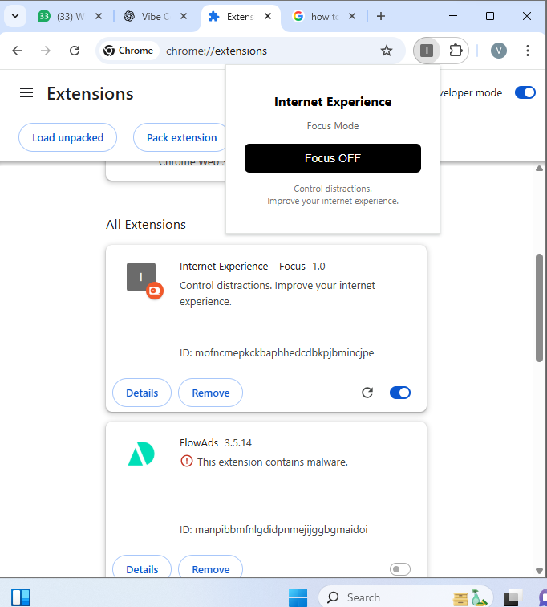
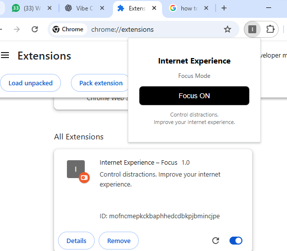

# Internet Experience – Focus

A simple browser extension to reduce distractions and improve how you use the internet.

## What it does
- One-click Focus Mode
- Helps you stay intentional online
- No account. No tracking. No ads.

## Screenshots

### Focus OFF

### Focus ON

## Install (Manual)
1. Download this repository as ZIP
2. Unzip the folder
3. Open Chrome → chrome://extensions
4. Enable Developer Mode
5. Click "Load unpacked"
6. Select the folder

## Why
The internet is powerful — but distracting.  
**Internet Experience** is about taking control back.

This is the first product in the *Internet Experience* suite.

